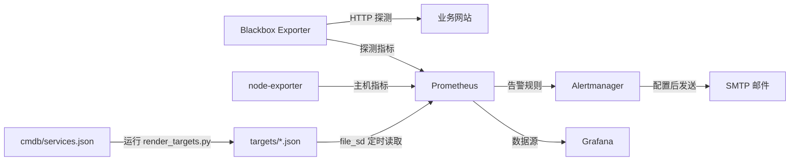

# 单机监控架构

```mermaid
flowchart LR
  B[Blackbox Exporter] -->|HTTP 探测| W[业务网站]
  N[node-exporter] -->|主机指标| P[Prometheus]
  B -->|探测指标| P
  S[cmdb/services.json] -->|运行 render_targets.py| T[targets/*.json]
  T -->|file_sd 定时读取| P
  P -->|告警规则| A[Alertmanager]
  A -->|配置后发送| E[SMTP 邮件]
  P -->|数据源| G[Grafana]
```

编辑服务清单后运行 `python3 cmdb/render_targets.py`。安装器默认写入每分钟执行一次的 crontab 同步任务（`--no-sync` 可跳过），Prometheus 随后按 `file_sd` 的刷新间隔读取目标文件。

本机探测只覆盖业务网站在这台服务器上的可访问性；需要从互联网验证域名和公网链路时，应另设外部探测点。
